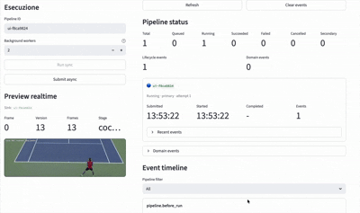
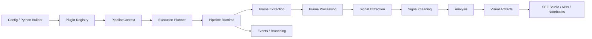

# SEF

[](pyproject.toml)

[](docs/index.md)

[](LICENSE)

**SEF is an experimental Python framework for building modular computer-vision
signal-extraction pipelines.**


It separates video acquisition, frame processing, signal extraction, cleaning,
analysis, visualization, runtime monitoring, and UI composition into explicit
contracts. The project is architecture-focused and currently pre-1.0: public
APIs are being hardened and may still evolve before a stable release.

## SEF Studio Demo



## Processing Example

The same sequence before and after the SEF processing pipeline.

| Pre-processed video | Processed video |
|---|---|
|  |  |
## Why SEF

SEF is designed for research, experimentation, and framework-oriented computer
vision workflows where the pipeline matters as much as the individual model.

Use it when you want to:

- compose video-analysis pipelines from small interchangeable stages;
- switch between programmatic and config-driven pipeline construction;
- run batch and streaming-compatible stages through a shared runtime;
- expose analyzer output as UI-agnostic visual artifacts;
- build custom plugins without editing the execution engine;
- inspect execution plans, runtime state, logs, outputs, and artifacts from a UI.

## Key Features

- **Modular pipeline architecture** for extractors, processors, cleaners,
  analyzers, visualizers, exporters, and branching rules.
- **Streaming runtime** with bounded buffers and latency policies.
- **Runtime execution planner** that records batch/streaming decisions.
- **Plugin registry** with categories, aliases, descriptors, and config-driven
  construction.
- **Visual artifacts** decoupled from UI frameworks.
- **Sync and async execution** through pipeline runners and monitors.
- **Event-driven branching** for secondary pipelines triggered by domain events.
- **SEF Studio** Streamlit UI for composing, running, and monitoring pipelines.
- **Versioned configuration** for evolving declarative pipeline schemas.

## Architecture Overview

SEF keeps the framework core independent from concrete OpenCV, YOLO, Matplotlib,
and Streamlit adapters. The core owns contracts, planning, runtime execution,
events, typed errors, buffers, artifacts, and plugin resolution.



<!-- PLACEHOLDER: Add high-level architecture image matching the Mermaid flow; purpose: provide a polished visual for readers who do not inspect diagrams; ideal placement: directly after the Architecture Overview paragraph. -->

<!-- PLACEHOLDER: Add execution/runtime flow diagram showing batch vs streaming decisions, buffers, and latency policy; purpose: clarify the adaptive runtime at a glance; ideal placement: after the Mermaid diagram. -->

The detailed architecture, public contracts, and extension rules live in the
[MkDocs documentation](docs/index.md).

## Quick Example

SEF pipelines can be built from configuration and resolved through the plugin
registry:

```python
from library.core import ConfigPipelineBuilder, Pipeline
from library.core.plugins import create_builtin_registry

registry = create_builtin_registry()

config = {
    "schema_version": "1.0",
    "pipeline": {
        "frame_extractor": {
            "name": "opencv_buffered",
            "params": {"path": "videos/Baloons.mp4"},
        },
        "signal_extractor": {
            "name": "opencv_tracker",
            "params": {"start_box": [100, 200, 50, 80]},
        },
        "signal_cleaners": [
            {"name": "moving_average", "params": {"window_size": 5}},
        ],
        "analyzers": [
            {"name": "vertical_position"},
        ],
        "visualizers": [
            {"name": "matplotlib"},
        ],
    },
}

context = ConfigPipelineBuilder(registry).build_context(config)
outputs = Pipeline(context, pipeline_id="demo-run").run()

print(outputs.results)
print(outputs.final_artifacts)
```

For a minimal runnable example without OpenCV or UI dependencies, see
[`examples/minimal_pipeline.py`](examples/minimal_pipeline.py).

## Visual Results

SEF is built around visual inspection, replayable artifacts, and UI-friendly
outputs. The repository should eventually include real captures from the current
pipeline and SEF Studio workflows.

### Tracking Playback

<!-- PLACEHOLDER: Add before/after tracking playback GIF using a real repository video; purpose: show how tracked objects become annotated playback artifacts; ideal placement: first item in Visual Results. -->

### Annotated Playback

<!-- PLACEHOLDER: Add annotated playback clip with bounding boxes, trajectories, and frame metadata; purpose: demonstrate visual artifact output quality; ideal placement: after Tracking Playback. -->

### Optical Flow

<!-- PLACEHOLDER: Add dense optical flow visualization from an actual SEF run; purpose: show motion-field analysis output; ideal placement: Optical Flow subsection. -->

### Signal Graphs

<!-- PLACEHOLDER: Add signal graph screenshot for vertical/horizontal position or velocity; purpose: show analyzer-to-visualizer data flow; ideal placement: Signal Graphs subsection. -->

### Barrier Counting

<!-- PLACEHOLDER: Add barrier counting screenshot or GIF with counted crossings; purpose: demonstrate geometric event analysis; ideal placement: Barrier Counting subsection. -->

### Pose Tracking

<!-- PLACEHOLDER: Add COCO/YOLO pose tracking GIF from a real pipeline run; purpose: show realtime or playback skeleton analysis; ideal placement: Pose Tracking subsection. -->

### Motion Analysis

<!-- PLACEHOLDER: Add motion-analysis comparison panel with source, processed frame, and output artifact; purpose: show intermediate artifacts and inspection workflow; ideal placement: Motion Analysis subsection. -->

## SEF Studio

`SEF Studio` is the Streamlit application built on top of the core framework.
It is not a separate engine: it uses the same registry, config builder,
pipeline runtime, monitors, outputs, and artifacts exposed by the library.

Current UI goals:

- compose pipeline stages visually;
- edit and submit config-driven runs;
- inspect execution plan and runtime status;
- monitor logs by level;
- preview realtime outputs when supported;
- browse generated artifacts and analyzer results.

```bash
streamlit run ui/app.py
```

<!-- PLACEHOLDER: Add screenshot of SEF Studio pipeline composer canvas; purpose: show visual pipeline construction; ideal placement: start of SEF Studio section. -->

<!-- PLACEHOLDER: Add screenshot of Run & Monitor tab with live preview, status, logs, and plan view; purpose: show runtime observability; ideal placement: after the SEF Studio feature list. -->

<!-- PLACEHOLDER: Add screenshot of artifacts/results panel; purpose: show final outputs and visual artifacts; ideal placement: end of SEF Studio section. -->

## Documentation

The README is intentionally concise. Use the MkDocs documentation for technical
details, contracts, and extension guidance:

- [Overview](docs/overview.md)
- [Getting Started](docs/getting-started.md)
- [Public API](docs/public-api.md)
- [Configuration](docs/configuration.md)
- [Plugin Authoring](docs/plugin-authoring.md)
- [Streaming Runtime](docs/streaming-runtime.md)
- [Error Handling](docs/error-handling.md)
- [Versioning](docs/versioning.md)
- [Generated API](docs/reference/generated-api.md)

Build the docs locally:

```bash
pip install -e ".[docs]"
mkdocs serve
```

## Installation

SEF currently targets Python 3.11+.

```bash
pip install -e .
```

For the full local development environment, including UI and computer-vision
dependencies:

```bash
pip install -r requirements.txt
```

## Project Status

SEF is experimental and evolving.

- The project is pre-1.0.
- Public APIs are being documented and hardened.
- Configuration schemas are versioned, but compatibility policy is still
  maturing.
- The current implementation is suitable for experimentation, research,
  demos, and architecture exploration.
- It should not yet be presented as production-stable infrastructure.

No benchmark, adoption, or production-readiness claims are made here.

## Repository Map

```text
library/core/        Public contracts, runtime, registry, artifacts, events
library/*            Concrete computer-vision components and visualizers
ui/                  Streamlit application built on the core framework
docs/                MkDocs public documentation
examples/            Minimal runnable examples
tests/               Core, registry, builder, streaming, and UI service tests
```

## Core Authors

- Matteo Vittori
- Alejandro Innocenzi
