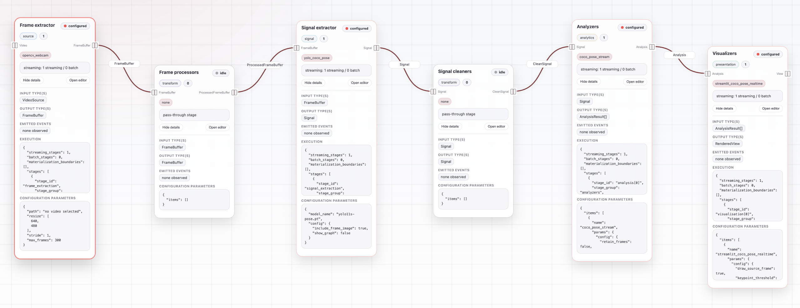
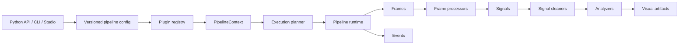
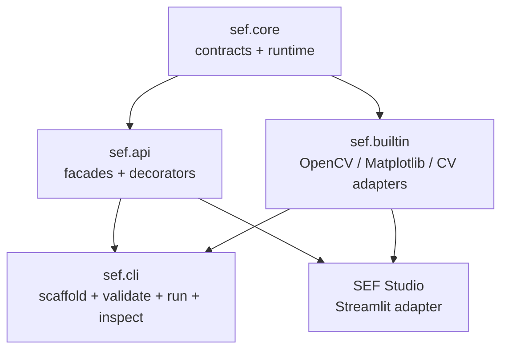
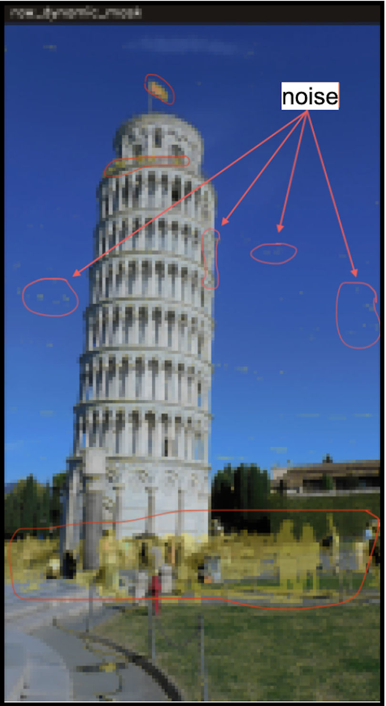

<div align="center">


### Signal Extraction Framework

**Modular • Streaming • Inspectable • Reproducible**

*Build computer-vision pipelines around signals, not monolithic scripts.*

<br>

[](https://pypi.org/project/sef/)
[](pyproject.toml)

[](https://nonamedeo.github.io/SEF/)

[](LICENSE)

<br>

 [Documentation](https://nonamedeo.github.io/SEF/) •  [PyPI](https://pypi.org/project/sef/) •  [Benchmarks](benchmarks/README.md)

</div>

---

<div align="center">



</div>

---

<div align="center">
    
## Performance Highlights


| Memory (RSS) | Peak Allocations | Runtime Overhead | Realtime Latency |
|:--------------:|:------------------:|:------------------:|:------------------:|
| **↓ 84%** | **↓ 98%** | **1.06×** | **↓ 74%** |

---

</div>

Recent synthetic benchmarks show that SEF can:

- reduce process memory usage by up to **84%** through end-to-end streaming;
- reduce Python peak allocations by up to **98%**;
- keep architectural overhead close to a direct procedural implementation (**1.06×**);
- reduce realtime latency by up to **74%** through configurable backpressure policies.

See [Benchmarks](benchmarks/README.md) for reproducible commands, raw CSV files, execution plans, and generated charts.

---

## ✨ Why SEF

SEF is designed for projects where the **pipeline architecture matters as much as the computer-vision algorithm itself**.

Instead of hiding the workflow inside monolithic OpenCV scripts, SEF turns every stage into an explicit, inspectable, and reusable component.

SEF provides:

- **modular pipeline contracts** for acquisition, processing, signal extraction, analysis, and visualization;
- **hybrid batch/streaming execution** with automatic materialization boundaries;
- **plugin-based extensibility** through decorators and runtime registries;
- **UI-agnostic artifacts** reusable from Streamlit, notebooks, CLIs, or future interfaces;
- **inspectable execution plans** for debugging and reproducibility;
- **versioned configurations** to reproduce experiments over time.

SEF is **not** a model-training framework, a dashboard application, or a generic workflow engine.

It is an architectural layer that sits **between raw computer-vision libraries and domain-specific applications**, making video-to-signal pipelines easier to build, explain, benchmark, and evolve.

## Use Cases

Use SEF when the pipeline structure matters as much as the individual computer
vision model:

- motion tracking and displacement analysis;
- ArUco marker detection and relative motion analysis;
- frame preprocessing, masking, stabilization, and intermediate inspection;
- video-to-signal extraction followed by cleaning and analytics;
- UI-agnostic visual artifact generation for dashboards, notebooks, or CLIs;
- rapid experimentation with custom pipeline components;
- teaching or evaluating modular computer-vision architectures.

SEF is not intended to replace model-training frameworks, annotation platforms,
or low-level OpenCV scripts when a single script is enough.

## Quick Start

Install the core package:

```bash
pip install sef
```

Install only the adapter stacks you need:

```bash
pip install "sef[opencv]"        # OpenCV video/tracking/ArUco components
pip install "sef[visualization]" # Matplotlib visualizers
pip install "sef[ui]"            # Streamlit Studio
pip install "sef[yolo]"          # Ultralytics pose extraction
pip install "sef[pose]"          # COCO pose analyzer helpers
pip install "sef[all]"           # all runtime adapter extras
```

Create and inspect a starter project:

```bash
sef init tracking-demo
sef doctor --config pipeline.yaml
sef validate pipeline.yaml --strict
sef run pipeline.yaml --dry-run --explain
```

For a dependency-light custom component scaffold:

```bash
sef init plugin
sef components inspect sample_count
python -m pytest tests/test_custom_components.py
```

## Python API

The common path is intentionally short: describe a source, add stages, and run.

```python
import sef

outputs = (
    sef.video("videos/input.mp4", max_frames=300)
    .resize(640, 480)
    .extract("opencv_tracker", tracker_type="MIL", start_box=[100, 200, 50, 80])
    .clean("moving_average", window_size=5)
    .analyze("vertical_position")
    .visualize("matplotlib")
    .run(pipeline_id="demo-run")
)

print(outputs.results)
print(outputs.final_artifacts)
```

The facade accepts registered plugin names, component classes, component
instances, or plain Python callables:

```python
import sef


@sef.processor(
    "grayscale",
    description="Convert one frame image to grayscale.",
    metadata={"domain": "preprocessing", "input": "Frame", "output": "Frame"},
)
def grayscale(image):
    return image.mean(axis=2)


outputs = (
    sef.pipeline("custom-run", include_builtins=True)
    .frames("opencv_buffered", path="videos/input.mp4")
    .process("grayscale")
    .signals("opencv_tracker", tracker_type="MIL", start_box=[100, 200, 50, 80])
    .analyze("vertical_position")
    .run()
)
```

Use `sef.orchestrator()` when execution needs lifecycle callbacks, background
submission, active-id tracking, or event-driven branching. Branching and
orchestration are intentionally Python-only for now; YAML config describes one
pipeline graph.

## Plugin Authoring

Function decorators cover the simple authoring path and expose rich registry
metadata:

```python
import sef
from sef.core.interfaces import StageCapabilities


@sef.analyzer(
    "vertical_velocity",
    description="Estimate vertical velocity from a tracked signal.",
    version="1.0.0",
    aliases=("velocity_y",),
    metadata={
        "domain": "motion",
        "tags": ["tracking", "kinematics"],
        "input": "Signal",
        "output": "TwoDimGraphData",
        "params": {"fps": {"type": "float", "default": 30.0}},
    },
    capabilities=StageCapabilities.streaming(stateful=False, realtime_safe=True),
)
def vertical_velocity(signal, fps: float = 30.0):
    ...
```

Available public function decorators:

- `@sef.frame_extractor`
- `@sef.processor`
- `@sef.frame_buffer_processor`
- `@sef.signal_extractor`
- `@sef.cleaner`
- `@sef.analyzer`
- `@sef.visualizer`

Advanced components should implement contracts from `sef.core.interfaces` and
register through `PluginRegistry` when they need explicit lifecycle, streaming,
or integration behavior. Branching rules remain part of the advanced API.

See [Plugin Authoring](docs/plugin-authoring.md) and
[Plugin Metadata](docs/plugin-metadata.md).

## Command Line

The `sef` CLI scaffolds projects, validates configs, explains execution plans,
runs pipelines, and inspects component catalogs:

```bash
sef init [tracking-demo|plugin] [--force]
sef doctor [--config pipeline.yaml]
sef validate <config> [--strict] [--debug]
sef run <config> [--dry-run] [--explain] [--output outputs/run] [--debug]
sef components list [--category analyzer] [--json]
sef components inspect <name> [--category analyzer] [--json]
sef config schema [--format json|yaml]
sef version
```

Local modules under `plugins/*.py` are imported before `validate`, `run`, and
`components` commands. CLI diagnostics use branded `SEF` status lines with
severity-aware colors in interactive terminals; set `NO_COLOR=1` for plain
logs.

## Architecture

SEF keeps the core independent from concrete OpenCV, YOLO, Matplotlib, and
Streamlit adapters. The core owns contracts, planning, runtime execution,
events, typed errors, buffers, artifacts, and plugin resolution.





## Validated Architectural Properties

✓ Hybrid runtime efficiency

✓ Configurable latency management

✓ Low architectural overhead

✓ Memory-efficient streaming execution

✓ Reproducible execution plans

## Design Principles

- **Small public API first**: common workflows go through `import sef`.
- **Advanced API remains available**: custom runners, branching, registries, and
  framework integrations live in `sef.core`.
- **Core is adapter-free**: OpenCV, Matplotlib, Streamlit, YOLO, and pose helpers
  are optional extras.
- **Plugins are explicit**: categories, names, aliases, metadata, capabilities,
  and config construction are registry-backed.
- **Artifacts are UI-agnostic**: visualizers return `VisualArtifact` values, not
  Streamlit widgets or notebook globals.
- **Config is pipeline-only**: orchestration and branching stay in Python until
  real usage patterns justify declarative support.

## Comparisons

| Tool type | SEF position |
|---|---|
| OpenCV scripts | SEF adds reusable pipeline contracts, config, execution planning, artifacts, and plugin inspection. |
| Model frameworks | SEF orchestrates computer-vision pipeline stages; it is not a training framework. |
| Workflow engines | SEF is domain-specific for frame/signal/visual-artifact pipelines, not a general DAG scheduler. |
| Dashboard apps | SEF keeps output UI-agnostic so Streamlit, notebooks, CLIs, or future UIs can consume the same artifacts. |

## Roadmap

Near term:

- stabilize decorator-based plugin authoring;
- improve plugin metadata conventions and catalog output;
- expand `sef init plugin` examples;
- tighten README/docs around current public APIs;
- expand benchmark coverage to OpenCV-backed and Studio-facing workloads.

Later:

- richer Studio component catalog and visual pipeline editing;
- broader intermediate artifact inspection;
- more built-in analyzers and visualizers;
- package-level plugin discovery only if external plugin distribution becomes a
  real need;
- declarative orchestration/branching only after Python usage patterns are
  clear.

## Visual Results

| Pre-processed video | Processed video |
|---|---|
|  |  |

| Original / Pre-processed | Noise / Motion Mask | Motion Mask | Final Output |
|---|---|---|---|
|  |  |  |  |

## SEF Studio

`SEF Studio` is the Streamlit application built on top of the same runtime. It
is not a separate engine: visual composition, Python facade usage, and
versioned config resolve to the same core execution model.

```bash
pip install -e ".[ui]"
streamlit run ui/app.py
```


## Documentation

- [Overview](docs/overview.md)
- [Getting Started](docs/getting-started.md)
- [Public API](docs/public-api.md)
- [Configuration](docs/configuration.md)
- [Registry](docs/registry.md)
- [Plugin Authoring](docs/plugin-authoring.md)
- [Plugin Metadata](docs/plugin-metadata.md)
- [Streaming Runtime](docs/streaming-runtime.md)
- [Error Handling](docs/error-handling.md)
- [Versioning](docs/versioning.md)

Build docs locally:

```bash
pip install -e ".[docs]"
mkdocs serve
```

## Repository Map

```text
sef/                 Pythonic public API
sef/core/            Public contracts, runtime, registry, artifacts, events
sef/builtin/         Optional concrete computer-vision components
sef/cli/             Command-line parser, handlers, diagnostics, scaffolds
ui/                  Streamlit application built on the core framework
docs/                MkDocs documentation
benchmarks/          Architecture validation benchmarks
examples/            Minimal runnable examples
tests/               Core, API, CLI, registry, streaming, and UI service tests
```

## Project Status

- Experimental, pre-1.0.
- Public API is being documented and hardened.
- Config schema is versioned.
- Optional dependencies are split by feature extras.
- Suitable for research, demos, and framework exploration.
- Not yet presented as production-stable infrastructure.

## Core Authors

- Matteo Vittori
- Alejandro Innocenzi

## Acknowledgements

Special thanks to:

- Michele Loreti, for guidance and advice throughout the project.
- Tomek Paczkowski, for kindly granting ownership of the `sef` package name on
  PyPI.
