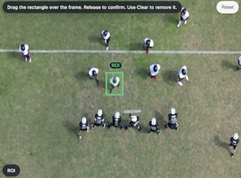
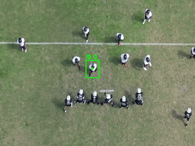

# SEF

[](pyproject.toml)

[](https://nonamedeo.github.io/SEF/)

[](LICENSE)

**SEF is an experimental Python framework for building modular computer-vision
signal-extraction pipelines through a small Pythonic API and an extensible
runtime core.**


It separates video acquisition, frame processing, signal extraction, cleaning,
analysis, visualization, runtime monitoring, and UI composition into explicit
contracts. The recommended API hides that machinery behind `import sef`, while
the lower-level core remains available for advanced registry, runtime, and
integration use cases.

The project is architecture-focused and currently pre-1.0: public APIs are
being hardened and may still evolve before a stable release.


## Processing Example

The same sequence before and after the SEF processing pipeline.

| Pre-processed video | Processed video |
|---|---|
|  |  |
## Why SEF

SEF is designed for research, experimentation, and framework-oriented computer
vision workflows where the pipeline matters as much as the individual model.

Use it when you want to:

- compose video-analysis pipelines from small interchangeable stages;
- switch between programmatic and config-driven pipeline construction;
- run batch and streaming-compatible stages through a shared runtime;
- expose analyzer output as UI-agnostic visual artifacts;
- build custom plugins without editing the execution engine;
- inspect execution plans, runtime state, logs, outputs, and artifacts from a UI.

## Key Features

- **Modular pipeline architecture** for extractors, processors, cleaners,
  analyzers, visualizers, exporters, and branching rules.
- **Streaming runtime** with bounded buffers and latency policies.
- **Runtime execution planner** that records batch/streaming decisions.
- **Plugin registry** with categories, aliases, descriptors, and config-driven
  construction.
- **Visual artifacts** decoupled from UI frameworks.
- **Sync and async execution** through pipeline runners and monitors.
- **Event-driven branching** for secondary pipelines triggered by domain events.
- **SEF Studio** Streamlit UI for composing, running, and monitoring pipelines.
- **Versioned configuration** for evolving declarative pipeline schemas.

## Architecture Overview

SEF keeps the framework core independent from concrete OpenCV, YOLO, Matplotlib,
and Streamlit adapters. The core owns contracts, planning, runtime execution,
events, typed errors, buffers, artifacts, and plugin resolution.

```mermaid
flowchart LR
    API["Pythonic API / Studio / Config"] --> Config["Versioned Pipeline Config"]
    Config --> Registry["Plugin Registry"]
    Registry --> Context["PipelineContext"]
    Context --> Planner["Execution Planner"]
    Planner --> Runtime["Pipeline Runtime"]

    Runtime --> Frames["Frame Extraction"]
    Frames --> Processing["Frame Processing"]
    Processing --> Signals["Signal Extraction"]
    Signals --> Cleaning["Signal Cleaning"]
    Cleaning --> Analysis["Analysis"]
    Analysis --> Visuals["Visual Artifacts"]
    Runtime --> Events["Events / Branching"]
    Visuals --> UI["SEF Studio / APIs / Notebooks"]
```



<!-- PLACEHOLDER: Add high-level architecture image matching the Mermaid flow; purpose: provide a polished visual for readers who do not inspect diagrams; ideal placement: directly after the Architecture Overview paragraph. -->

<!-- PLACEHOLDER: Add execution/runtime flow diagram showing batch vs streaming decisions, buffers, and latency policy; purpose: clarify the adaptive runtime at a glance; ideal placement: after the Mermaid diagram. -->

The detailed architecture, public contracts, and extension rules live in the
[MkDocs documentation](https://nonamedeo.github.io/SEF/).

## Quick Example

The recommended API keeps the common path short: describe the source, choose the
stages, and run.

```python
import sef

outputs = (
    sef.video("videos/Baloons.mp4", max_frames=300)
    .resize(640, 480)
    .extract(
        "opencv_tracker",
        tracker_type="MIL",
        start_box=[100, 200, 50, 80],
        config={"show": False},
    )
    .clean("moving_average", window_size=5)
    .analyze("vertical_position")
    .visualize("matplotlib")
    .run(pipeline_id="demo-run")
)

print(outputs.results)
print(outputs.final_artifacts)
```

The same facade accepts plugin names, component classes, component instances, or
plain Python functions. This keeps simple experiments lightweight without
removing the advanced extension model.

`.run()` on a pipeline builder is the direct single-run shortcut. Use
`sef.orchestrator().run(pipeline)` instead when execution needs lifecycle
callbacks, background submission with `submit()`, active-id tracking, or
event-driven branching.

```python
import cv2
import sef


@sef.processor("grayscale")
def grayscale(image):
    """Convert one OpenCV frame image to grayscale."""
    return cv2.cvtColor(image, cv2.COLOR_BGR2GRAY)


outputs = (
    sef.video("videos/input.mp4")
    .process("grayscale")
    .extract("opencv_tracker", tracker_type="MIL", start_box=[100, 200, 50, 80])
    .analyze("vertical_position")
    .run()
)
```

For custom classes, pass the class directly and SEF will register it in the
pipeline-scoped registry:

```python
import sef

outputs = (
    sef.pipeline("quickstart")
    .frames(DemoFrameExtractor, frame_count=3)
    .signals(DemoSignalExtractor)
    .analyze(SampleCountAnalyzer)
    .visualize(SummaryVisualizer)
    .run()
)
```

Advanced users can still drop down to the versioned configuration path and core
contracts when they need full control over registries, orchestration, or
runtime integration:

```python
from sef.builtin.registry import create_builtin_registry
from sef.core import ConfigPipelineBuilder, Pipeline

registry = create_builtin_registry()

config = {
    "schema_version": "1.0",
    "pipeline": {
        "frame_extractor": {
            "name": "opencv_buffered",
            "params": {"path": "videos/Baloons.mp4"},
        },
        "signal_extractor": {
            "name": "opencv_tracker",
            "params": {"tracker_type": "MIL", "start_box": [100, 200, 50, 80]},
        },
        "signal_cleaners": [
            {"name": "moving_average", "params": {"window_size": 5}},
        ],
        "analyzers": [
            {"name": "vertical_position"},
        ],
        "visualizers": [
            {"name": "matplotlib"},
        ],
    },
}

context = ConfigPipelineBuilder(registry).build_context(config)
outputs = Pipeline(context, pipeline_id="demo-run").run()
```

For a minimal runnable example without OpenCV or UI dependencies, see
[`examples/minimal_pipeline.py`](examples/minimal_pipeline.py).

## Command Line

After installing SEF in editable mode, the `sef` command can scaffold projects,
validate configs, explain execution plans, run pipelines, and inspect registered
components:

```bash
pip install -e .
sef init tracking-demo
sef doctor --config pipeline.yaml
sef validate pipeline.yaml --strict
sef run pipeline.yaml --dry-run --explain
sef run pipeline.yaml --pipeline-id demo-run --output outputs/demo-run
sef components list
sef components list --category analyzer
sef components inspect vertical_position
sef config schema --format yaml
sef version
```

Video/OpenCV configs such as `tracking-demo` require the OpenCV extra:

```bash
pip install -e ".[opencv]"
```

Local plugin modules placed in `plugins/*.py` are imported before `validate`,
`run`, and `components` commands, so decorator plugins such as
`@sef.analyzer("my_analyzer")` are immediately available to configs.

The same example can be run without installing console scripts:

```bash
python -m examples.minimal_pipeline
python -m sef validate pipeline.yaml
```

## Orchestration

`sef.pipeline()` describes one pipeline. `sef.orchestrator()` coordinates
execution when an application needs lifecycle callbacks, background submission,
or event-driven branching:

```python
import sef

events = []

pipeline = (
    sef.pipeline("tracked-run")
    .frames(MyFrameExtractor)
    .signals(MySignalExtractor)
    .analyze(MyAnalyzer)
)

outputs = (
    sef.orchestrator()
    .on_lifecycle("after_run", events.append)
    .run(pipeline)
)
```

Branching and orchestration are intentionally not part of the YAML config
schema yet. A config file describes a single pipeline graph; application code
decides whether to run it directly, submit it in the background, observe
lifecycle events, or attach branching rules.


## Intermediate Artifacts

SEF can expose intermediate frame artifacts produced during the pipeline,
including pre-processed frames, cleaned frames, masks, overlays, and final debug
views.

This makes each run easier to inspect, compare, and reproduce: users can see not
only the final result, but also how each processing stage transformed the input.

| Original / Pre-processed | Noise / Motion Mask | Motion Mask | Final Output |
|---|---|---|---|
|  |  |  |  |

## Visual Results

SEF is built around visual inspection, replayable artifacts, and UI-friendly
outputs. The repository should eventually include real captures from the current
pipeline and SEF Studio workflows.

### Tracking Playback
| Pre-processed video | Processed video |
|---|---|
|  |  |

### Annotated Playback

<!-- PLACEHOLDER: Add annotated playback clip with bounding boxes, trajectories, and frame metadata; purpose: demonstrate visual artifact output quality; ideal placement: after Tracking Playback. -->

### Optical Flow

<!-- PLACEHOLDER: Add dense optical flow visualization from an actual SEF run; purpose: show motion-field analysis output; ideal placement: Optical Flow subsection. -->

### Signal Graphs

<!-- PLACEHOLDER: Add signal graph screenshot for vertical/horizontal position or velocity; purpose: show analyzer-to-visualizer data flow; ideal placement: Signal Graphs subsection. -->

### Barrier Counting

<!-- PLACEHOLDER: Add barrier counting screenshot or GIF with counted crossings; purpose: demonstrate geometric event analysis; ideal placement: Barrier Counting subsection. -->

### Pose Tracking

<!-- PLACEHOLDER: Add COCO/YOLO pose tracking GIF from a real pipeline run; purpose: show realtime or playback skeleton analysis; ideal placement: Pose Tracking subsection. -->

### Motion Analysis

<!-- PLACEHOLDER: Add motion-analysis comparison panel with source, processed frame, and output artifact; purpose: show intermediate artifacts and inspection workflow; ideal placement: Motion Analysis subsection. -->

## SEF Studio


`SEF Studio` is the Streamlit application built on top of the same pipeline
runtime. It is not a separate engine: visual composition, Python facade usage,
and versioned config all resolve to the same core execution model.


Current UI goals:

- compose pipeline stages visually;
- edit and submit config-driven runs;
- inspect execution plan and runtime status;
- monitor logs by level;
- preview realtime outputs when supported;
- browse generated artifacts and analyzer results.

```bash
pip install -e ".[ui]"
streamlit run ui/app.py
```

<!-- PLACEHOLDER: Add screenshot of SEF Studio pipeline composer canvas; purpose: show visual pipeline construction; ideal placement: start of SEF Studio section. -->

<!-- PLACEHOLDER: Add screenshot of Run & Monitor tab with live preview, status, logs, and plan view; purpose: show runtime observability; ideal placement: after the SEF Studio feature list. -->

<!-- PLACEHOLDER: Add screenshot of artifacts/results panel; purpose: show final outputs and visual artifacts; ideal placement: end of SEF Studio section. -->

## Documentation

The README is intentionally concise. Use the MkDocs documentation for technical
details, contracts, and extension guidance:

- [Overview](docs/overview.md)
- [Getting Started](docs/getting-started.md)
- [Public API](docs/public-api.md)
- [Configuration](docs/configuration.md)
- [Plugin Authoring](docs/plugin-authoring.md)
- [Streaming Runtime](docs/streaming-runtime.md)
- [Error Handling](docs/error-handling.md)
- [Versioning](docs/versioning.md)
- [Generated API](docs/reference/generated-api.md)

Build the docs locally:

```bash
pip install -e ".[docs]"
mkdocs serve
```

## Installation

SEF currently targets Python 3.11+.

```bash
pip install -e .
```

Install only the adapter stacks you need:

```bash
pip install -e ".[opencv]"        # OpenCV sources, processors, ArUco, video artifacts
pip install -e ".[visualization]" # Matplotlib visualizers
pip install -e ".[ui]"            # Streamlit Studio
pip install -e ".[yolo]"          # Ultralytics pose extraction
pip install -e ".[pose]"          # COCO pose analyzer model helpers
pip install -e ".[all]"           # all runtime adapter extras
```

For the full local development environment:

```bash
pip install -e ".[dev]"
```

## Project Status

SEF is experimental and evolving.

- The project is pre-1.0.
- Public APIs are being documented and hardened.
- Configuration schemas are versioned, but compatibility policy is still
  maturing.
- The current implementation is suitable for experimentation, research,
  demos, and architecture exploration.
- It should not yet be presented as production-stable infrastructure.

No benchmark, adoption, or production-readiness claims are made here.

## Repository Map

```text
sef/                 Recommended Pythonic public API
sef/core/        Public contracts, runtime, registry, artifacts, events
sef/builtin/*            Concrete computer-vision components and visualizers
ui/                  Streamlit application built on the core framework
docs/                MkDocs public documentation
examples/            Minimal runnable examples
tests/               Core, registry, builder, streaming, and UI service tests
```

## Core Authors

- Matteo Vittori
- Alejandro Innocenzi

## Acknowledgements

We would like to extend our special thanks to:
- Michele Loreti (for his guidance and advice throughout the project)
- Tomek Paczkowski (for kindly granting us ownership of the "sef" package name on PyPi)