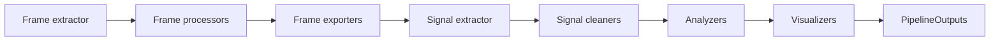

# Overview

SEF is a signal extraction framework for video and image sequences. The core
library is designed as a small orchestration engine around stable contracts:
frames enter the pipeline, signal samples are extracted, analyzers create typed
data, visualizers create UI-agnostic artifacts, and the runtime returns
`PipelineOutputs`.

## Layered Architecture

```text
library/core/
├── artifacts/       Data values: Frame, Signal, IData outputs, pose data
├── events/          Event, EventBus, pipeline lifecycle events
├── interfaces/      Public component and runtime ports
├── pipeline/        Builders, context, execution, streaming planner, runner
├── plugins/         PluginRegistry and PluginDefinition
├── realtime/        Realtime frame publication contracts
└── visualization/   VisualArtifact, PipelineOutputs, run metadata
```

Concrete packages outside `library/core` implement adapters:

- `library/frame_extractors`
- `library/frame_processors`
- `library/signal_extractors`
- `library/signal_cleaners`
- `library/analyzers`
- `library/visualizers`
- `ui`

The dependency direction is inward: concrete adapters depend on core contracts;
core contracts do not depend on UI frameworks or concrete CV implementations.

## Execution Flow



The runtime may execute compatible stages as streaming segments, but the
conceptual contract remains the same: each stage consumes the previous stage's
public output type and publishes the next public output type.

## Stable Responsibilities

`PipelineContext` owns topology and construction invariants.

`Pipeline` owns execution of an already-built context.

`ConfigPipelineBuilder` owns declarative config parsing, version normalization,
and registry-backed component construction.

`PluginRegistry` owns category/name to factory resolution.

`PipelineOutputs` owns final analytical results, visual artifacts, debug
artifacts, run metadata, and reproducibility metadata.

## Non-Goals of Core

The core library does not own:

- browser or webcam permission prompts;
- Streamlit rerun behavior;
- OpenCV GUI window lifecycle;
- model downloads;
- device picker UI;
- long-term artifact storage;
- HTTP APIs.

Those concerns belong to adapters or applications.
